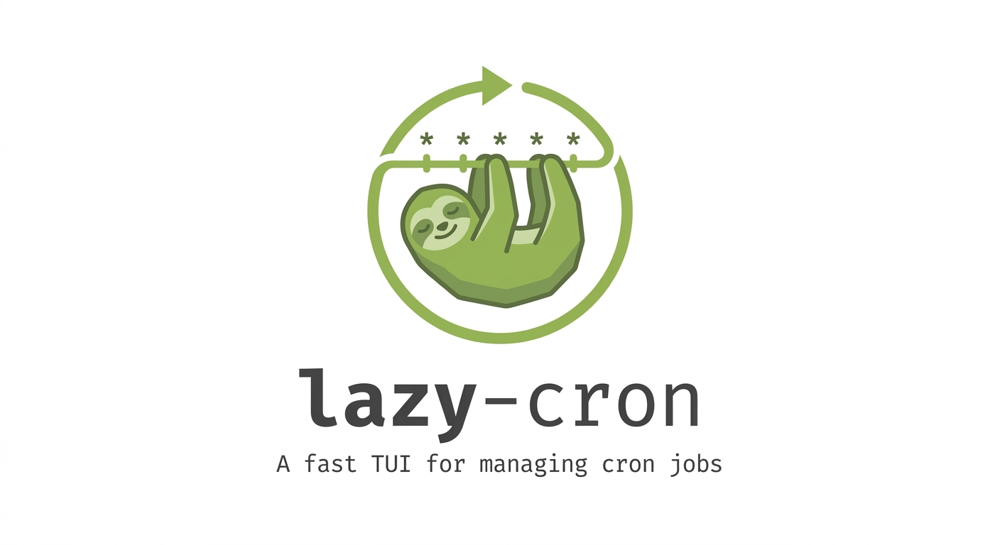
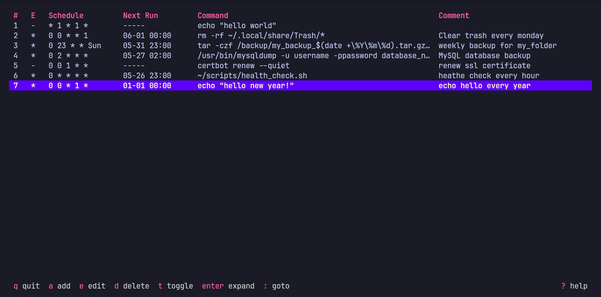
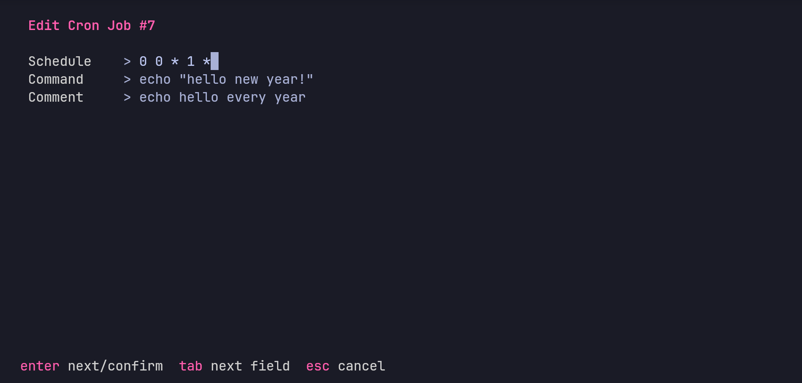
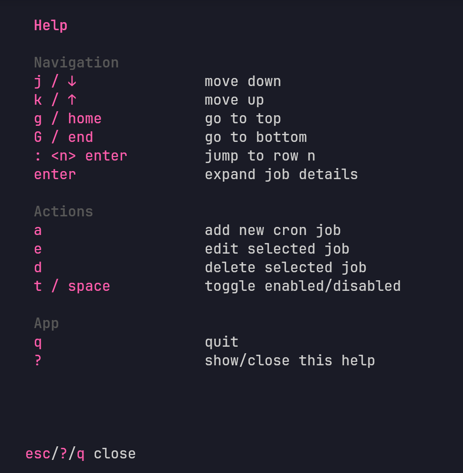

<div align="center">
  
  <br/>
  <br/>
  <p><strong>A fast, keyboard-driven TUI for managing cron jobs on Linux.</strong></p>

  [](https://go.dev)
  [](./LICENSE)
</div>

---

## Install

```bash
go install github.com/domenez-dev/lazycron@latest
```

Or build from source:

```bash
git clone https://github.com/domenez-dev/lazycron.git
cd lazycron
go build -o lazycron .
```

## Usage

```bash
lazycron
```

Reads from and writes to the current user's crontab (`crontab -l` / `crontab -`). No config file, no root required.

---

## Screenshots

### Main View



### Add / Edit Job



### Help



---

## Features

- List all cron jobs with schedule, next run time, command, and comment
- Add, edit, and delete jobs through guided forms
- Toggle jobs on/off without removing them (commented-out lines)
- Vim-style navigation (`j`/`k`, `g`/`G`)
- Jump to any row with `:` (like vim's `:N` goto)
- Expand a job to see full details
- Fixed bottom bar with context-aware shortcuts on every screen
- Inline schedule validation before saving

---

## Next Features

- Crontab Reader to make it human-readable
- Cron Scheduler builder to create complex schedules with human-friendly inputs
- premade schedule templates (@daily, @weekly, @monthly...)
- better interface for edit/add jobs

---

## Keybindings

### List view

| Key | Action |
|-----|--------|
| `j` / `↓` | Move down (wraps) |
| `k` / `↑` | Move up (wraps) |
| `g` / `Home` | Go to top |
| `G` / `End` | Go to bottom |
| `: <n> Enter` | Jump to row n |
| `Enter` | Expand job details |
| `t` / `Space` | Toggle enabled / disabled |
| `a` | Add new cron job |
| `e` | Edit selected job |
| `d` | Delete selected job (with confirmation) |
| `?` | Open help screen |
| `q` | Quit |

### Add / Edit form

| Key | Action |
|-----|--------|
| `Enter` | Next field / confirm |
| `Tab` | Next field |
| `Shift+Tab` | Previous field |
| `Esc` | Cancel |

---

## Crontab format

lazy-cron reads and writes standard crontab syntax:

```
# ┌── minute (0-59)
# │  ┌── hour (0-23)
# │  │  ┌── day of month (1-31)
# │  │  │  ┌── month (1-12)
# │  │  │  │  ┌── day of week (0-6, Sunday=0)
# │  │  │  │  │
  *  *  *  *  *  /path/to/command # optional comment
```

**Disabled jobs** are stored as commented-out lines (`# * * * * * ...`) so they are preserved and can be re-enabled at any time.

---

## Requirements

- Go 1.21+
- Linux (relies on the `crontab` CLI)
- A terminal with 256-color support

---

## Contributing

Pull requests are welcome. For larger changes, open an issue first to discuss what you'd like to change.

1. Fork the repository
2. Create a feature branch (`git checkout -b feat/my-feature`)
3. Commit your changes
4. Open a pull request

---

## License

MIT — see [LICENSE](./LICENSE).
